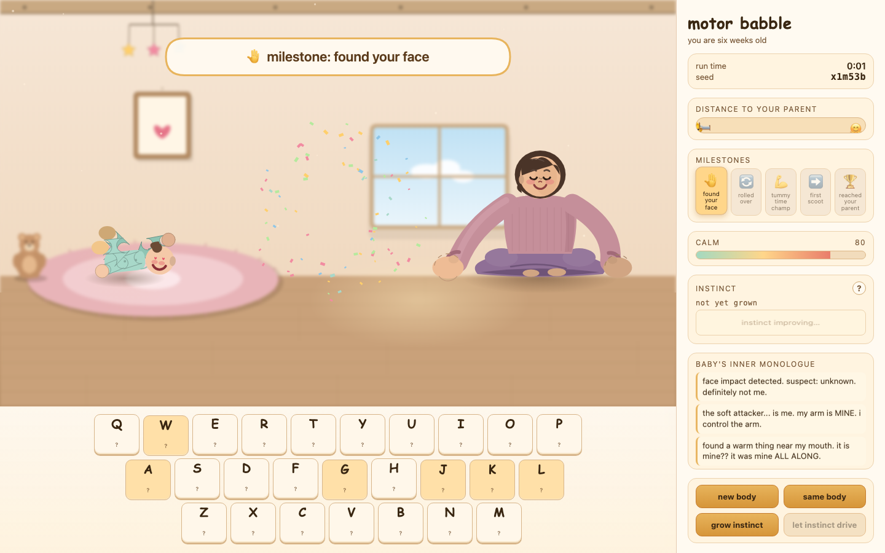

# Motor Babble

**You are six weeks old. These 26 keys are wired to your muscles. Nobody will tell you which is which.**

A physics game about the hardest reinforcement learning problem anyone ever solves: being a baby. Every letter on your keyboard fires a muscle in a floppy physics newborn, the wiring is hidden, and it gets re-scrambled every run. Figure out your own body by mashing keys, roll over, survive tummy time, and crawl across the nursery to your parent.



The game is honest about where the comedy comes from: real newborns actually do this. They punch themselves in the face and blame the world. They kick the crib bar and file the pain under "unexplained cruelty." Their motor commands come out smeared with noise, their vision is a 20/400 blur, and every milestone (hand found, roll conquered, first scoot) is the reward signal that slowly turns flailing into intent.

## Play

```bash
cd motor-babble
python3 -m http.server 8765
# open http://localhost:8765
```

Hold letter keys and watch what happens. The journal in the sidebar is the baby's inner monologue, and it is never correct about causality. Cumulative use of a key slowly reveals its wiring on the key strip (that is proprioception). Share a body with a friend via `?seed=`: same seed, same scrambled nervous system.

- **New body** reshuffles the wiring. **Same body** restarts the run you were getting good at.
- Landing milestones matures you: motor noise anneals, vision sharpens, your neck strengthens.
- Calm is a resource. The crib bar drains it. A hand discovered near your mouth restores it.

## The RL angle, played from the inside

Most RL demos have you watch an agent learn. Here you are the agent: unknown action space, noisy actuation, sparse and badly-attributed rewards. That frustration you feel at minute one and the coordination you have at minute ten is the entire field, experienced firsthand.

Two built-in bridges make it explicit:

- **Grow instinct** (in the game): runs evolutionary policy search over rhythmic controllers on the same physics, live, with a learning curve you can watch. Then let the evolved instinct drive and race it.
- **`python/`**: a full Gymnasium environment of the same baby (pymunk physics, same 8 muscles, same milestones) with PPO training via stable-baselines3. The signature knob is `scrambled_wiring=True`, which randomly permutes and sign-flips the action channels every episode, the exact scramble the human player suffers. Can your policy learn a body it has never met? See [python/README.md](python/README.md).

```bash
cd python
python -m venv .venv && source .venv/bin/activate && pip install -r requirements.txt
python train.py --task crawl                 # PPO on a fixed body
python train.py --task crawl --scrambled     # PPO vs a new wiring every episode
python watch.py --run <run_name>             # watch your trained baby
```

## Architecture

Two independent halves that rhyme but do not share code: a zero-build browser game (`js/`, Planck.js physics, ES modules, no bundler) and a Python RL sandbox (`python/`). The JS simulation core is DOM-free, so the human player and the in-browser evolution mode step the exact same world. `CLAUDE.md` has the full module map.

## License

MIT
